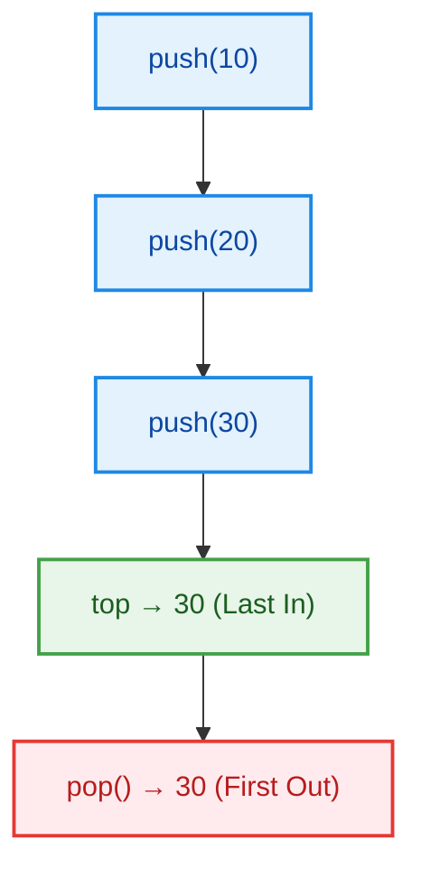
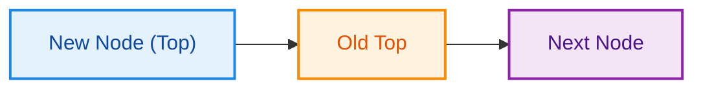
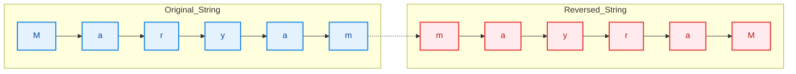
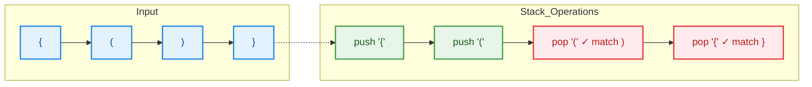
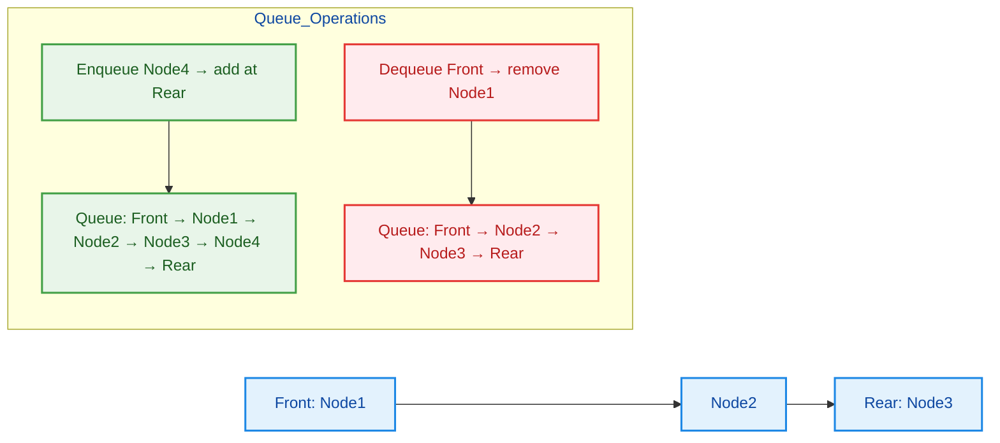
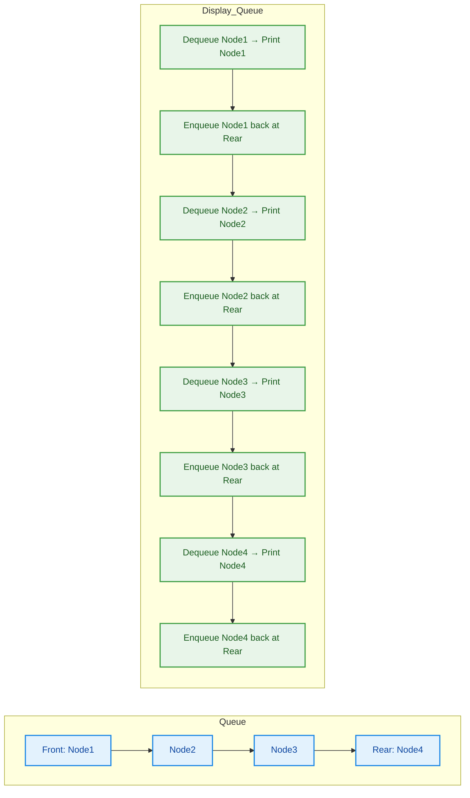

<h1 align="center">🚀 Data Structures Lab – Stack & Queue (Java)</h1>


---

## 📺 Lecture Video

Watch the full Stack & Queue lab lecture on YouTube:

👉 [Stack & Queue Lecture](https://youtu.be/7oQVEISshrk)

---

## 1. 🌟 Introduction

**Stack** and **Queue** are fundamental **linear data structures** used to organize data based on strict ordering rules.

They are essential for understanding:

- Function calls and recursion (call stack)
- Undo / Redo operations
- Expression evaluation
- Task scheduling and buffering
- Real-world data flow problems

### 2. 🧠 Core Concepts
#### 🔹 Stack (LIFO – Last In, First Out)

- Elements are added and removed from the same end called **top**
- Main operations:
  - `push` → insert element at top
  - `pop` → remove element from top
  - `peek` → view top element
  - `isEmpty`

**📌 Real-world analogy:**

A stack of plates — the last plate placed is the first removed.


**Complexity:**

- Time: `O(1)` for push/pop
- Space: depends on implementation

---

#### Queue (FIFO – First In, First Out)

- Elements are added from the rear and removed from the front, **queue** processes elements in the same order they arrive.
- Main operations:
  - `enqueue` → insert at rear
  - `dequeue` → remove from front
  - `peek`
  - `isEmpty`

**📌 Real-world analogy:**

People standing in a line.

**Complexity:**

- Time: `O(1)`
- Space: depends on implementation

---

## 3. 📂 Repository Structure

```bash
java-ds-lab-stack-queue/
│
├── README.md
│
├── src/
│   ├── examples/
│   │   ├── ArrayStack.java
│   │   ├── LinkedListStack.java
│   │   └── LinkedListQueue.java
│   │
│   ├── activities/
│   │   ├── ReverseSLLUsingStack.java
│   │   ├── SortStack.java
│   │   ├── PalindromeUsingStack.java
│   │   ├── ReverseQueueUsingRecursion.java
│   │   └── ReverseQueueUsingStack.java
│   │
│   └── chapters/
│       └── Lecture 05 - Stack & Queue.pdf
│
├── assignment/
│   └── README.md
│
└── .gitignore
```

---

## 4. 🖥 Lecture Examples (Explained in Class)

All files in [`src/examples/`](src/examples) were **fully explained during the lecture**, with diagrams, tracing, and dry runs.

---

### 4.1 🟦 Stack Using Array

📁 [`ArrayStack.java`](src/examples/ArrayStack.java)

**Idea:**
Implement stack behavior using an array and a `top` index.

**Key points explained:**

- `top = -1` → empty stack
- Increment `top` before insert
- Decrement `top` after removal
- Dynamic resizing when array is full

**Stack Growth Visualization**



> **📌 Important:**
> This example teaches **memory layout, overflow handling**, and why arrays need resizing.

---

### 4.2 🟩 Stack Using Linked List

📁 [`LinkedListStack.java`](src/examples/LinkedListStack.java)

**Idea:**
Replace array with nodes to avoid resizing.

**Key concepts:**

- `top` always points to head node
- Push = insert at head
- Pop = remove head

**Push Operation**



**📌 Why linked list stack?**

- No overflow
- Dynamic memory
- Clean pointer manipulation

---

### 4.3 🔁 Reverse String Using Stack

**Logic:**

1. Push each character
2. Pop characters to reverse order



> Demonstrates **pure LIFO behavior**.

---

### 4.4 ⚖️ Balanced Parentheses

**Goal:**
Validate expressions using stack.

**Rules:**

- Push opening brackets
- Pop and match on closing bracket
- Stack must be empty at the end



**📌 Used in:**

- Compilers
- Syntax validation
- Code editors

---

### 4.5 🟨 Queue Using Linked List

📁 [`LinkedListQueue.java`](scr/examples/LinkedListQueue.java)

**Structure:**

- `front` → first element
- `rear` → last element

**Enqueue / Dequeue Flow**



**Operations:**

- `Enqueue` → attach at `rear`
- `Dequeue` → remove from `front`

---

### 4.6 👀 Display Queue Without Losing Order

**Technique:**

- Dequeue
- Print
- Enqueue back



> This reinforces **queue rotation** and FIFO understanding.

---

## 5. 🎯 Activities (Student Practice)

📁 [`src/activities/`](src/activities/)

These tasks are **intentionally incomplete** and must be solved by students.

| Activity                  | Concept                 |
| ------------------------- | ----------------------- |
| Reverse SLL using Stack   | Stack + Linked List     |
| Sort Stack                | Nested stack logic      |
| Palindrome using Stack    | String processing       |
| Reverse Queue (Recursion) | Queue + recursion       |
| Reverse Queue (Stack)     | Stack–Queue interaction |

> ❗ No solutions here.
> Students must reason, design, and implement.

---

## 📂 Assignments – Lecture 05

**📌 Assignment questions are NOT written here.**

To access the assignment:

1. Open the [`assignment/`](assignments) folder
2. Read `README.md`
3. Watch the assignment video
4. Follow submission instructions

👉 [`assignment/README.md`](assignments/README.md)

> This ensures fairness and prevents copying.

---

## 7. 🏃 Running the Code

```bash
git clone https://github.com/Maryam-Skaik/java-ds-lab-stack-queue.git
cd java-ds-lab-stack-queue/src/examples
javac *.java
java ArrayStack
```

---

## 8. 💡 Tips for Students

- Always track top, front, rear
- Draw before coding
- Trace push/pop manually
- Stack problems → think LIFO
- Queue problems → think FIFO

---

## 🎓 Learning Outcomes

After this lab, students will:

- Implement stack & queue from scratch
- Understand internal data flow
- Apply stack/queue to real problems
- Be ready for recursion internals and trees

---

## 📝 License

This project is provided for educational use in the Java Data Structures Lab.
