# 📚 Assignments – Data Structures Lab (Stack & Queue Module)

This folder contains all assignments related to **Lecture 05 – Stack & Queue** in the Java Data Structures Lab.
Students must watch the assignment video before attempting the tasks.

---

## 🎥 Assignment Video

All assignment tasks are explained in detail through **a recorded YouTube video.**

**Instructions for students:**

1. Watch the full assignment video carefully.
2. Write all tasks in your notebook.
3. Implement each problem using stack and queue concepts only where required.
4. Submit your solutions through the course platform (Moodle).

Video Link:
https://youtu.be/Aa08m_qay6Q

---

## 📝 About This Folder

This folder may include:

- Written descriptions or hints for tasks
- Starter code templates
- Model solutions after deadlines
- Additional clarifications and notes

> ⚠️ Note: Assignments are not fully written here to ensure independent problem solving. All task details are in the video.

---

## ✨ Topics Covered in Assignments

Assignments in this module reinforce **stack and queue fundamentals** and focus on the following:

### 1. Stack Concepts

- Implementing stack with array or linked list
- Using stack to reverse data structures
- Palindrome checking using stack
- Understanding LIFO behavior through examples

**Sample Flow Diagram – Stack Reversal**


### 2. Queue Concepts

- Implementing queue using linked list
- Display queue without altering order
- Reverse queue using:
  - Stack
  - Recursion

**Sample Flow Diagram – Queue Reversal Using Stack**

```mermaid
flowchart LR
    A["Queue Front: 1"] --> B["2"] --> C["3"] --> D["Rear: 4"]
    D --> E["Stack Push 4,3,2,1"]
    E --> F["Pop from Stack → Rebuild Queue"]
```



### 3. Stack + Linked List Interaction

- Reverse singly linked list using stack
- Sort stack elements in ascending order

**Sample Flow Diagram – Reverse SLL Using Stack**

```mermaid
flowchart LR
    A["Head → 1 → 2 → 3 → null"]
    A --> B["Push 1,2,3 to stack"]
    B --> C["Pop → Reconstruct reversed SLL → 3 → 2 → 1 → null"]
```



### 4. Student Guidelines

- **Do not search for solutions online**. The exercises are designed to **train problem-solving.**
- **Trace every step manually** on paper if needed.
- Pay attention to **top, front, and rear pointers.**
- Use **comments in code** to explain your logic.
- Follow **LIFO and FIFO principles** strictly.

---

## 5. Folder Structure Reference

```bash
java-ds-lab-stack-queue/
│
├── assignment/
│   └── README.md              # This file
```

---

## 6. Tips for Success

- Start with simple examples, then scale up.
- Test edge cases:
  - Empty stack / queue
  - Single element
  - Multiple elements
- Compare **stack vs queue** behavior for the same problem to see differences.

---

> **📌 Remember: All assignment task details are in the video.**
> The goal is to develop **critical thinking and independent implementation skills.**
