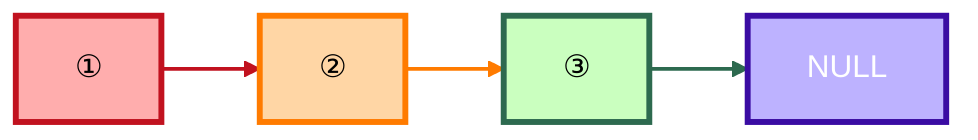
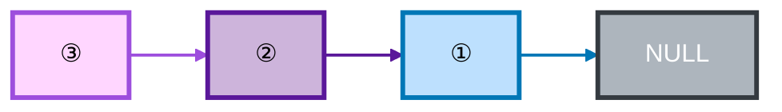
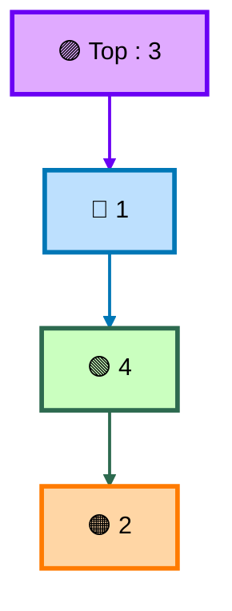
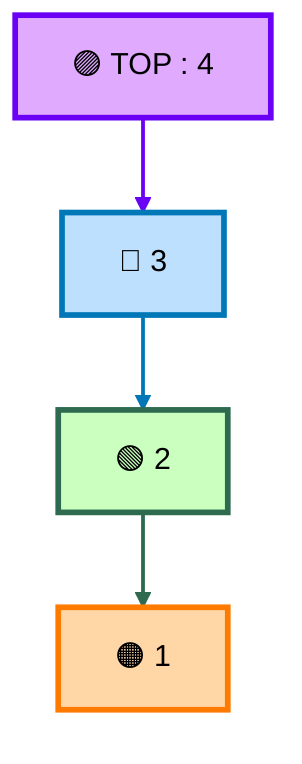
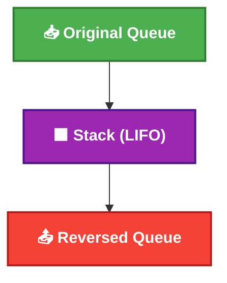

# 🧪 Stack & Queue Activities – Data Structures Lab (Java)

This folder contains **practice activities** for **Lecture 05 – Stack & Queue** in the Data Structures Lab.  
These activities are designed to help students **apply Stack and Queue concepts** to real problems using **Java and Linked Lists**.

> 🎯 **Goal:** Strengthen your understanding of how **Stack (LIFO)** and **Queue (FIFO)** behave internally and how they can be used to solve common data structure problems.

---

## 📂 Folder Structure

```pgsql
activities/
├── ReverseSLLUsingStack.java
├── SortStack.java
├── PalindromeUsingStack.java
├── ReverseQueueUsingRecursion.java
└── ReverseQueueUsingStack.java
```


Each file represents **one activity/problem** that you are required to solve.

---

## 🎥 Reference Material

Before attempting these activities, make sure you:
- Watch **Lecture 05 – Stack & Queue**
- Review the Stack & Queue examples discussed in class
- Understand how stacks and queues are implemented using **linked lists**

---

## 🤔 Why These Activities Matter

Stacks and queues are not just abstract concepts.  
They are widely used in:
- Expression evaluation
- Undo/Redo operations
- Function calls (call stack)
- String processing
- Reversal problems
- Scheduling systems

These activities train you to:
- Choose the **right data structure**
- Understand **data flow direction**
- Write clean and logical Java code

---

## 🧩 Solutions to Activities

Now, the solutions to these activities are available! Below, you'll find a detailed explanation of each solution, followed by time complexity analysis.

---

## 🧩 Activity 1: Reverse Singly Linked List Using Stack

**File:** `ReverseSLLUsingStack.java`

### 🔍 Problem Statement
Given a **Singly Linked List (SLL)**, reverse the list using a **Stack**.

### 📌 Rules
- You must use a **Stack**
- Do NOT reverse by changing data values
- Reversal must be done by manipulating **node references**

### 🧠 Approach

- **Push all nodes onto a stack**, and then rebuild the list by popping nodes from the stack.
- This approach uses the **LIFO (Last-In-First-Out)** nature of the stack to reverse the order of the nodes.

### 🕒 Time Complexity

- **Time Complexity:** O(n), where n is the number of nodes in the linked list.
- **Space Complexity:** O(n), as we use a stack to store all nodes.

### 📐 Visualization

**Original List**



**After Reversal**



---

## 🧩 Activity 2: Sort Stack Using Another Stack

**File:** `SortStack.java`

### 🔍 Problem Statement

Sort a stack of integers using **only stack operations** and **one extra stack**.

### 📌 Rules

- You are NOT allowed to use arrays or loops for sorting logic
- Only `push`, `pop`, and `peek` operations are allowed
- Use an auxiliary stack to help with sorting

### 🧠 Approach

- Use the stack operations (`push`, `pop`, and `peek`) to sort the stack. We use an auxiliary stack to help maintain the sorted order.
- The algorithm is similar to **insertion sort**, but instead of using an array, we manipulate stacks.

### 🕒 Time Complexity

- **Time Complexity:** O(n^2), because for each element, we may have to push/pop all other elements from the auxiliary stack.
- **Space Complexity:** O(n), as we use one extra stack.

### 📐 Visualization

**Before Sorting**



**After Sorting (Ascending)**



---

## 🧩 Activity 3: Check Palindrome Using Stack

**File:** `PalindromeUsingStack.java`

### 🔍 Problem Statement

Given a string, determine whether it is a **palindrome using a Stack.**

### 📌 Rules

- Use a stack to store characters
- Compare characters from the string with popped stack elements
- Ignore case sensitivity if needed (based on your implementation)

### 🧠 Approach

- **Push all characters** of the string onto a stack.
- **Pop the stack** and compare each character with the string from the beginning. If they match, the string is a palindrome.

### 🕒 Time Complexity

- **Time Complexity:** O(n), where n is the length of the string (for both the push and pop operations).
- **Space Complexity:** O(n), as we use a stack to store characters.

### 📐 Visualization

**Example: "ABCBA"**


**Stack behavior:**


---

## 🧩 Activity 4: Reverse Queue

This activity has **two different approaches.**

### 🔹 Activity 4.1: Reverse Queue Using Recursion

**File:** `ReverseQueueUsingRecursion.java`

### 🔍 Problem Statement

Reverse a queue using **recursion only.**

### 📌 Rules

- Do NOT use any extra data structure
- Use recursion to reverse the queue
- Base case must be clearly defined

### 🧠 Approach

- **Dequeue an element**, reverse the rest of the queue recursively, and **enqueue the dequeued element** after recursion unwinds.
- This solution uses the system’s recursion stack to store the elements temporarily.

### 🕒 Time Complexity

- **Time Complexity:** O(n), where n is the number of elements in the queue (due to one dequeue and one enqueue per element).
- **Space Complexity:** O(n), due to the recursion stack.

### 📐 Visualization


**After recursion:**


---

### 🔹 Activity 4.2: Reverse Queue Using Stack

**File:** `ReverseQueueUsingStack.java`

### 🔍 Problem Statement

Reverse a queue using a **Stack.**

### 📌 Rules

- Dequeue all elements into a stack
- Pop from stack and enqueue back
- Compare this approach with the recursive one

### 🧠 Approach

- **Dequeue all elements from the queue** and push them onto a stack.
- **Pop elements from the stack** and enqueue them back into the queue. This reverses the order of the elements.

### 🕒 Time Complexity

- **Time Complexity:** O(n), where n is the number of elements in the queue.
- **Space Complexity:** O(n), as we use a stack to store the elements temporarily.

### 📐 Visualization



---

## 🚫 Common Student Mistakes

❌ Mixing stack and queue operations incorrectly<br>
❌ Forgetting base case in recursive queue reversal<br>
❌ Reversing data instead of links<br>
❌ Using arrays instead of stacks<br>
❌ Not testing edge cases (empty / single element)

---

## 🎯 Learning Outcomes

After completing these activities, you should be able to:

- Apply **Stack (LIFO)** logic correctly
- Apply **Queue (FIFO)** logic correctly
- Reverse data structures using different techniques
- Understand recursion vs. stack-based solutions
- Write clean and readable Java code

---

## ⏳ About Solutions

✅ **Solutions will be uploaded later** in a separate folder.

Until then:

- Try solving the problems on your own
- Trace the logic manually
- Test with multiple inputs

. 📌 Remember: understanding the process is more important than copying the solution.

---

## 👩‍🏫 Instructor

**Maryam Skaik**<br>
Teaching Assistant – Data Structures & Algorithms<br>
Java | Stack | Queue | Linked Lists

> *🌱 Practice well — these concepts will appear again in exams, quizzes, and future courses.*
